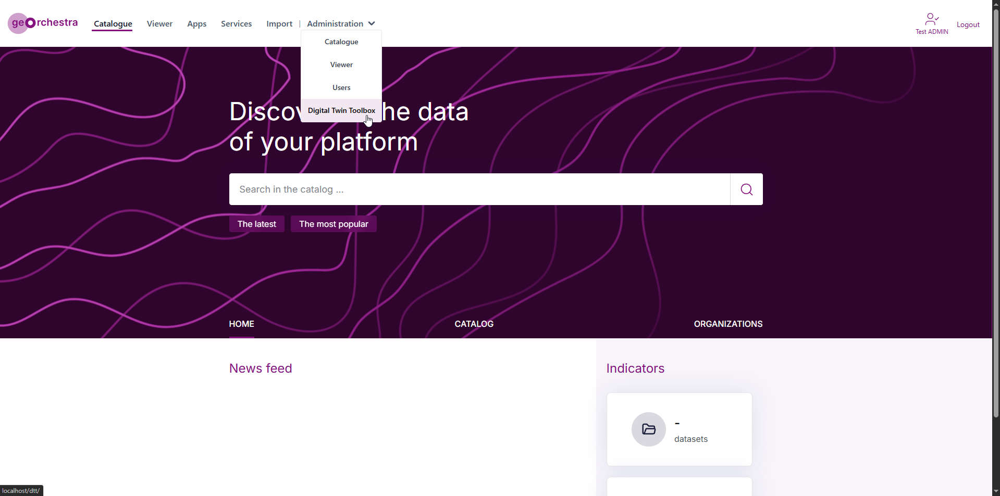
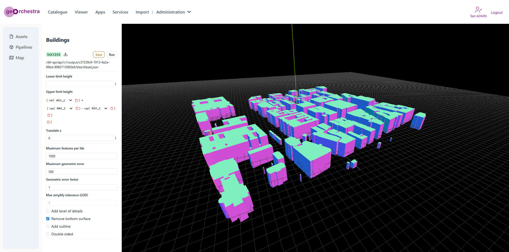
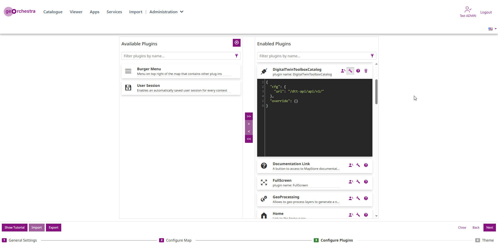
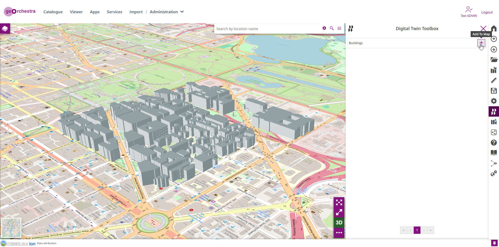

# Integration of Digital Twin Toolbox in geOrchestra with Docker

This branch showcase an integration of the [digital-twin-toolbox](https://github.com/geosolutions-it/digital-twin-toolbox) services inside the geOrchestra application. This setup **is not** production ready with the sole purpose of an experimental test.

## Quick Start

**1. Prerequisite**

* RAM

Grab a machine with a decent amount of RAM (16Gb is mandatory to run the full composition, more is better).

* Install Docker

An up-to-date [docker](https://docs.docker.com/engine/installation/) engine is required.

Note that docker-compose is not necessary anymore. 

**2. Download sources**

Clone this repo and its submodule using:
```
git clone --recurse-submodules https://github.com/geosolutions-it/georchestra-docker
```

Switch to the experimental branch dtt-24.0:
```
git checkout dtt-24.0
```

Update submodule with:
```
git submodule update
```

[Optional] On Windows OS you may need to ensure `LF` end of line, you can update it with:

```
./update-eol.bat
```

There is also an .sh version of the same script `update-eol.sh`

**3. Run**

The default docker-compose file contains all geOrchestra modules.

It's recommended to double-check the `docker-compose.yml` and `docker-compose.override.yml` files if you need to comment useless modules (e.g extractor, ... ).

You need to use the new Compose plugin V2, `docker-compose` (V1) is not supported by default: [https://docs.docker.com/compose/install/linux/](https://docs.docker.com/compose/install/linux/).   
If you still want to use the old `docker-compose` (V1), you need to remove all the parameters `depends_on` from the files `docker-compose.yml` and `docker-compose.override.yml`.

To run:

```
cd docker
docker compose up -d
```


To stop geOrchestra:
```
docker compose down
```

**4. Play**

Open [http://localhost/](http://localhost/) in your browser. Then:

To login, use these credentials:
 * `testuser` / `testuser`
 * `testadmin` / `testadmin`

**5. Digital Twin Toolbox User Interface**

- An admin super user (eg. `testadmin`) can access to the digital twin toolbox page using the administration


- Inside the `Digital Twin Toolbox` section (url path `/dtt/`) a user can upload assets and create 3D Tiles. It is possible to follow this [tutorial](https://github.com/geosolutions-it/digital-twin-toolbox/wiki/Tutorials) section to discover currently supported asset formats and available pipelines using the sample data.


- Installing the experimental [DigitalTwinToolboxCatalog](https://github.com/geosolutions-it/DigitalTwinToolboxCatalog/releases/download/v1.0.0-rc/DigitalTwinToolboxCatalog.zip) ([release v1.0.0-rc](https://github.com/geosolutions-it/DigitalTwinToolboxCatalog/releases/tag/v1.0.0-rc)) MapStore extension is possible to access the digital twin toolbox catalog and visualize generated 3D tiles in a viewer application. It's important to configure the plugin cfg `url` property with the following path `"/dtt-api/api/v1/"`


- Finally the `DigitalTwinToolboxCatalog` in action inside the MapStore viewer connecting to the digital twin toolbox pipeline API

